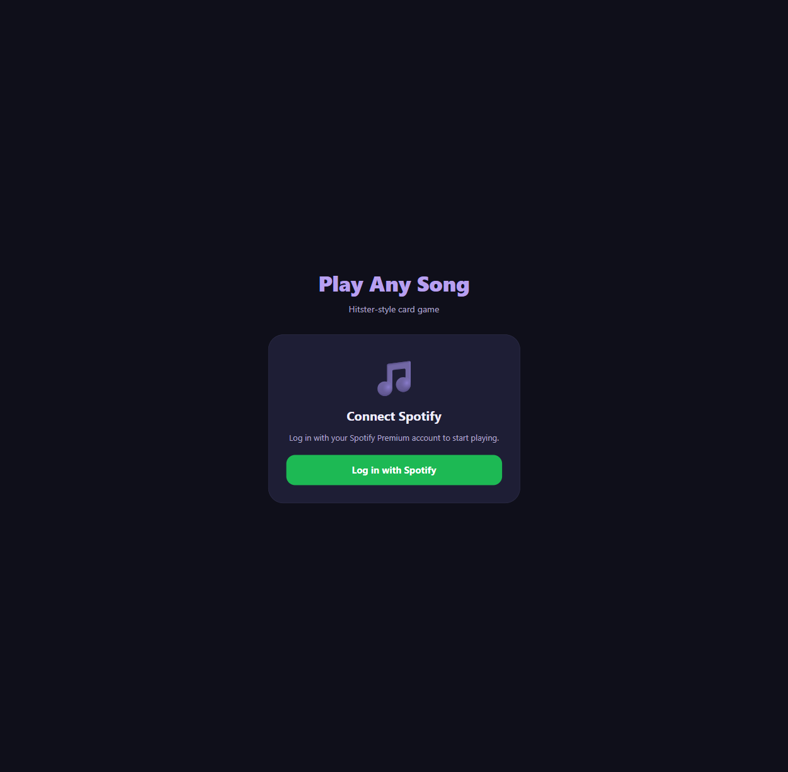
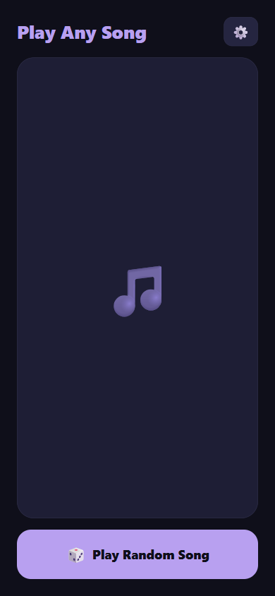
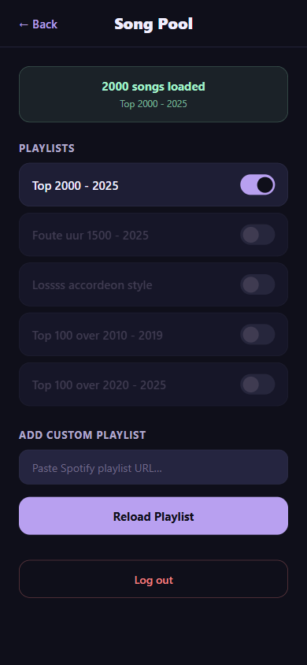

# Play Any Song

A Hitster-style card game powered by Spotify. Tap a button, get a random track from your playlists, then guess the year before revealing the answer. Built as a PWA you can install on phone or desktop.

> **Bring Your Own Keys.** This is a personal/open-source project, not a hosted service. Clone the repo, register your own Spotify app, and run it locally or deploy your own copy.

## Live demo

[https://NielsBlaak.github.io/play-any-song/](https://NielsBlaak.github.io/play-any-song/)

> The live demo runs in Spotify **Development Mode**, which limits access to 5 pre-approved users. If you want to try it yourself, the easiest path is to clone the repo and use your own Spotify app — see [Local setup](#local-setup).

## Screenshots

| Login | Game | Settings |
| --- | --- | --- |
|  |  |  |

## Tech stack

- **Vite 8** + **React 19** + **TypeScript 6**
- **Zustand 5** for global state
- **vite-plugin-pwa** for offline-capable PWA install
- **Spotify Web API** with Authorization Code + PKCE OAuth (no server, no client secret)

## Prerequisites

- **Node.js 20+**
- **Spotify Premium** account (required by the Web Playback API to control playback)
- A free **Spotify Developer** account

## Spotify Dashboard setup

1. Go to [developer.spotify.com/dashboard](https://developer.spotify.com/dashboard) and click **Create app**.
2. Fill in name, description (anything you like), and add the following **Redirect URIs**:
   - `http://127.0.0.1:5173/` &nbsp;— for local dev
   - `https://NielsBlaak.github.io/play-any-song/` &nbsp;— if deploying your own copy to GitHub Pages (replace `NielsBlaak` with your username when forking)
3. Select **Web API** under "Which API/SDKs are you planning to use?"
4. Save, then open the app's **Settings** page and copy the **Client ID**.
5. Open **User Management** and add the Spotify email of any user (yourself included — up to 5) who should be allowed to log in. Development Mode caps usage at 5 users; the Extended Quota tier requires a registered business and 250K MAU, so this app stays in Dev Mode.

The OAuth scopes the app requests:

```
user-read-private
user-read-email
user-read-playback-state
user-modify-playback-state
playlist-read-private
playlist-read-collaborative
```

## Local setup

```bash
git clone https://github.com/NielsBlaak/play-any-song.git
cd play-any-song
cp .env.example .env
# Paste your Spotify Client ID into .env, then:
npm install
npm run dev
```

Open [http://127.0.0.1:5173/](http://127.0.0.1:5173/) (not `localhost` — Spotify's redirect URI policy requires loopback IP `127.0.0.1`).

Click **Log in with Spotify**, accept the scopes, then open **⚙️ Settings** to load a playlist. The default playlists come bundled (no API call needed for the first play), and you can also paste any Spotify playlist URL.

## How playback works

- Spotify must already be open and playing something on at least one device when you press **Play Random Song** — the Web API requires an "active device" to target. The app pops open `open.spotify.com` if nothing is active.
- Only **Premium** accounts can control playback through the Web API; free accounts will see a 403.

## Deploy your own copy

The `.github/workflows/deploy.yml` workflow builds and publishes to GitHub Pages on every push to `main`.

1. Fork or push this repo to your own GitHub account.
2. In **Settings → Pages**, set the source to **GitHub Actions**.
3. In **Settings → Secrets and variables → Actions → Variables**, add `VITE_SPOTIFY_CLIENT_ID` with your Client ID. (Client IDs in PKCE apps are public — they end up in the bundle anyway — so a repo variable is fine.)
4. Push to `main`. The first run will publish to `https://NielsBlaak.github.io/play-any-song/` (or your fork's equivalent URL).
5. Register that URL as a redirect URI in your Spotify app (see step 2 of Dashboard setup).

## Scripts

```bash
npm run dev          # Vite dev server on http://127.0.0.1:5173
npm run build        # Type-check + production build to dist/
npm run preview      # Preview the production build locally
npm run lint         # ESLint
npm run type-check   # tsc --noEmit
npm run build-tracks # Rebuild src/data/defaultTracks.json from src/csv/
```

## License

[MIT](LICENSE) © 2026 Niels Blaak
